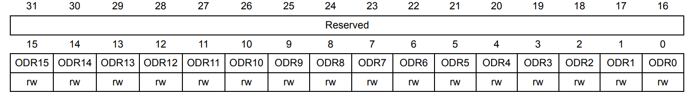

:figure-caption: Рисунок
:table-caption: Таблица

include::Tityl_list_3.adoc[lines=1..10]
[.text-right]

Лабораторная работа 2
include::Tityl_list_3.adoc[lines="12..25"]

<<Цель отчета>>

<<Регистр>>

<<Работа с кодом>>

<<Вывод по работе>>

== Цель отчета

. Изучить Регистры
. Изучить регистр общего назначения:
.. Операторные регистр
.. Вспомогательные регистры
.. Специальные регистры

. Выполнить работу с регистрами периферии с помощью использования специального класса С++ и через адресуемую ячейка памяти

== Регистр

* Регистры – это специальные ячейки памяти, расположенные непосредственно в процессоре. Работа с регистрами выполняется намного быстрее, чем с ячейками оперативной памяти, поэтому регистры активно используются как в программах на языке ассемблера, так и компиляторами языков высокого уровня.

.. Существуют регистры общего назначения и специальные регистры. Регистры общего назначения расположены внутри ядра микроконтроллера (сверхбыстрая память)

.. Регистры общего назначения - это сверхбыстрая память внутри процессора, предназначенная для хранения адресов и промежуточных результатов вычислений (регистр общего назначения/регистр данных) или данных, необходимых для работы самого процессора.

.. Регистры специального назначения расположены в ОЗУ микроконтроллера и используются для управления процессором и периферийными устройствами.

.. Каждый регистр в архитектуре ARM представляет собой ресурс памяти и имеет длину в 32 бита, где каждый бит можно представить в виде выключателя с помощью которого осуществляется управление тем или иным параметром микроконтроллера.

[#Регистр]
.Изображение регистра

* Регистры общего назначения
С точки зрения прикладного программиста, процессор располагает 16-ю 32-разрядными регистрами общего назначения (РОН, GPR), из которых три на деле имеют специальные функции:

* [*] Оперативные регистры
* [*] Вспомогательные регистры
* [*] Специальные регистры

* Оперативные регистры 
. регистры R0-R3, R12 являются оперативными (sratch) регистрами;
. любая функция может использовать эти регистры по своему усмотрению и уничтожать содержимое этих регистров;
. если функции нужны значения этих регистров после вызова другой функции, она должна сохранить их на стеке, а после вызова восстановить.

* Вспомогательные регистры
. регистры от R4-R11 являются вспомогательными;
. любая функция должна сохранить их на входе, а при выходе восстановить их значение.

* Специальные регистры
. регистр указателя на стек R13/SP, должен всегда указывать на последний элемент стека
или ниже него;
. регистр R15/PC есть программный счетчик;
. регистр R14/LR, содержит адрес возврата функции.

* В регистр специального назачения входят:

* [*] Название регистра;

* [*] Адрес регистра обозначается 32-битным шестнадцатеричным числом;

* [*] Тип доступа к ячейкам регистра;

* [*] Длина - количество ячеек в одном регистре. Мы будем работать с 32-битными регистрами;

* [*] Поле - набор ячеек регистра, отвечающих за работу одной из функции микроконтроллера;

* [*] Значение поля - есть пространство всех возможных величин, которые может принимать поле.

== Работа с кодом

* Так как регистр специального назначения - это просто адресуемая ячейка памяти, то в коде это может мы можем обратиться к данным по этому адресу, разыменовывая указатель, указывающий на этот адрес:

[source, cpp]
----
int main() 
{
 std::uint32_t* ptr = reinterpret_cast<std::uint32_t*>(0x40020014); // обращаемся к порту А -> GPIOA
 *ptr ^= (1U << 5U);
}
----

Либо же используя специальный класс, разница лишь в компактности кода:

[source, cpp]
----
int main() 
{
 GPIOA::ODR::ODR5::High::Set();
}
----
Пример кода с использование специального класса:

[source, cpp]
----
#include "rccregisters.hpp" // for RCC
#include "gpioaregisters.hpp" // for GPIOA
#include "gpiocregisters.hpp" // for GPIOэ
#include "tim1registers.hpp"

std::uint32_t SystemCoreClock = 16'000'000U;

extern "C" {
int __low_level_init(void)
{
  
}
}

void delay(int cycles)
{
  for(int i = 0; i < cycles; ++i)    
  {   
    asm volatile("");
  }    
}

int main()
{  
  // Подать тактирование на порт А
  RCC::AHB1ENR::GPIOAEN::Enable::Set() ;
  // Подать тактирование на порт А
  RCC::AHB1ENR::GPIOCEN::Enable::Set() ;
  // Порт  А.5 на вывод
  GPIOA::MODER::MODER5::Output::Set() ;
  // Порта С.5,С.8,С.9 на вывод
  GPIOC::MODER::MODER5::Output::Set() ;
  GPIOC::MODER::MODER8::Output::Set() ;
  GPIOC::MODER::MODER9::Output::Set() ;
   
  for(;;)
  {
    // включение 4 светодиодов
    GPIOA::ODR::ODR5::High::Set();
   
    GPIOC::ODR::ODR5::High::Set();
    
    GPIOC::ODR::ODR8::High::Set();
   
    GPIOC::ODR::ODR9::High::Set();
  
    delay(1000000); 
    
    // выключение 4 светодиодов
    GPIOA::ODR::ODR5::Low::Set();
   
    GPIOC::ODR::ODR5::Low::Set();
    
    GPIOC::ODR::ODR8::Low::Set();
   
    GPIOC::ODR::ODR9::Low::Set();
    
    delay(1000000);
  }
  
  return 1;
}
----

video::Picter/VID_1.mp4[]

Пример кода используя адресуемую ячейка памяти:

[source, cpp]
----
#include "rccregisters.hpp" // for RCC
#include "gpioaregisters.hpp" // for GPIOA
#include "gpiocregisters.hpp" // for GPIOэ
#include "tim1registers.hpp"

std::uint32_t SystemCoreClock = 16'000'000U;

extern "C" {
int __low_level_init(void)
{
  
}
}

void delay(int cycles)
{
  for(int i = 0; i < cycles; ++i)    
  {   
    asm volatile("");
  }    
}

int main()
{  
  // Подать тактирование на порт А
  RCC::AHB1ENR::GPIOAEN::Enable::Set() ;
  // Подать тактирование на порт А
  RCC::AHB1ENR::GPIOCEN::Enable::Set() ;
  // Порт  А.5 на вывод
  GPIOA::MODER::MODER5::Output::Set() ;
  // Порта С.5,С.8,С.9 на вывод
  GPIOC::MODER::MODER5::Output::Set() ;
  GPIOC::MODER::MODER8::Output::Set() ;
  GPIOC::MODER::MODER9::Output::Set() ;
   
  std::uint32_t* Port_A = reinterpret_cast<std::uint32_t*>(0x40020014); // обращаемся к порту А -> GPIOA
  
  std::uint32_t* Port_C = reinterpret_cast<std::uint32_t*>(0x40020814); // обращаемся к порту С -> GPIOС  
  for(;;)
  {
    // при первом входе в программу устанавливаем логическую единицу (+3 В в)
    // при следующем входе меняем значение бита в адрессе на другой 1 -> 0, 0 -> 1
    *Port_A ^= (1U << 5U);
    
    *Port_C ^= (1U << 5U);
    
    *Port_C ^= (1U << 8U);
    
    *Port_C ^= (1U << 9U);
  
    delay(1000000); 
        
  }
  
  return 1;
}
----

video::Picter/VID_2.mp4[]

Второй пример кода используя адресуемую ячейка памяти:

[source, cpp]
----
#include "rccregisters.hpp" // for RCC
#include "gpioaregisters.hpp" // for GPIOA
#include "gpiocregisters.hpp" // for GPIOэ
#include "tim1registers.hpp"

std::uint32_t SystemCoreClock = 16'000'000U;

extern "C" {
int __low_level_init(void)
{
  
}
}

void delay(int cycles)
{
  for(int i = 0; i < cycles; ++i)    
  {   
    asm volatile("");
  }    
}

int main()
{  
  // Подать тактирование на порт А
  RCC::AHB1ENR::GPIOAEN::Enable::Set() ;
  // Подать тактирование на порт А
  RCC::AHB1ENR::GPIOCEN::Enable::Set() ;
  // Порт  А.5 на вывод
  GPIOA::MODER::MODER5::Output::Set() ;
  // Порта С.5,С.8,С.9 на вывод
  GPIOC::MODER::MODER5::Output::Set() ;
  GPIOC::MODER::MODER8::Output::Set() ;
  GPIOC::MODER::MODER9::Output::Set() ;
   
  std::uint32_t* Port_A = reinterpret_cast<std::uint32_t*>(0x40020014); // обращаемся к порту А -> GPIOA
  
  std::uint32_t* Port_C = reinterpret_cast<std::uint32_t*>(0x40020814); // обращаемся к порту С -> GPIOС  
  for(;;)
  {
    *Port_A ^= 0x20; // 0x20 представляет число 0b00100000, 1 установлена в 5 бите числа  
    
    *Port_C ^= 0x320; // число представляет из себя определенное количество нулей, но в битах под номерами 5,8,9 установлена единица
  
    delay(1000000); 
    
  }
  
  return 1;
}
----

video::Picter/VID_3.mp4[]