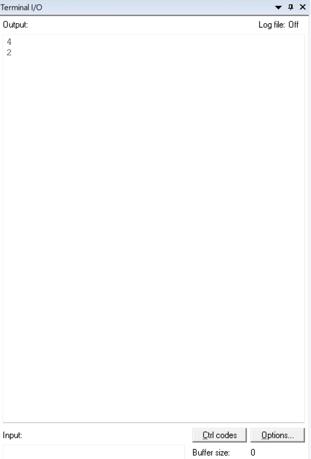
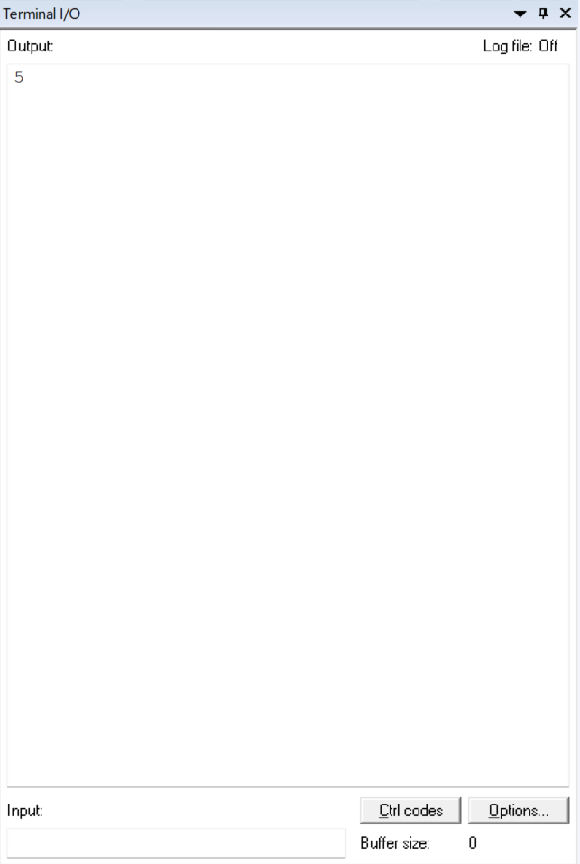

:figure-caption: Рисунок
:table-caption: Таблица

include::Tityl_list_3.adoc[lines=1..10]
[.text-right]

Лабораторная работа 3
include::Tityl_list_3.adoc[lines="12..25"]

<<Цель отчета>>

<<Регистры>>

<<Работа с кодом>>

<<Вывод по работе>>

== Цель отчета

. Изучить свойства унарного плюса 
. Изучить свойства 'X', где X является любимы символом
. Настроить модуль тактирования на частоту 32 МГц от внутреннего высокочастотного RC-генератора 16 МГц  

== Унарный плюс

Результатом унарного оператора плюса (+) является значение его операнда. Операнд оператора унарного оператора сложения должен иметь арифметический тип. 
Унарный оператор + может изменяет размер переменной

* Пример:
[source, cpp]
----
int main() 
{
 unsigned short x = 5;
printf ("%d\n",sizeof(+x));
printf ("%d\n",sizeof(x));
return 0;
}
----

.Результат работы кода

 * [*] Результат работы меняет размер unsigned short (2 байта) на размер в 4 байта .

== Запятая

Оператор запятая (,) позволяет объединить несколько выражений в одно выражение, таким образом в C++ вводится понятие выражение с запятой, имеющее общий вид записи:< выражение>, <выражение>, <выражение>.

Оператор «запятая» вызывает выполнение последовательности действий. Когда он используется с правой стороны оператора присваивания, то присваиваться будет значение последнего выражения, стоящего в разделенном запятыми списке.

* Пример:

[source, cpp]
----
int main() 
{
  int y = 10;
  int x;
  x = (y = y - 5, 25 / y);
  printf("%d", x);
  return 1;
}
----

.Результат работы кода

* [*] После выполнения х получит значение 5, поскольку исходным значением у было 10, а затем оно уменьшилось на 5. Затем 25 поделили на полученное 5 и получили результат.

* [*] Об операторе «запятая» следует думать как об обычном слове «и» в нормальном русском языке, когда оно используется в выражении «сделай это, и это, и это».

== Настройка тактирования

Для того чтобы тактовая частота стала 32 МГц требуется настроить поля:

* [*] PLLM;
* [*] PLLN;
* [*] PLLP;
* [*] PLLQ;
* [*] Настройка PLLQ требутся для передачи частоты на интерфейс USB.

Формула, по которой расчитывается системная тактовая частота:

* [*] F = F(PLL clock input) × (PLLN / PLLM) / PLLP​

С помощью формулу подобраны следующие значения:

* [*] PLLN = 128, 
* [*] PLLM = 32, 
* [*] PLLP = 2.

* Код программы:

[source, cpp]
----
#include "rccregisters.hpp" // for RCC
#include "gpioaregisters.hpp" // for GPIOA
#include "gpiocregisters.hpp" // for GPIOэ
#include "tim1registers.hpp"

std::uint32_t SystemCoreClock = 16'000'000U;

extern "C" {
int __low_level_init(void)
{
  
  RCC::CR::HSION::On::Set(); // Включаем внутренний генератор
  
  while (RCC::CR::HSIRDY::NotReady::IsSet()) // пустой цикл для ожидание пока внутренний генератор не настроится
  {

  }
  
  RCC::CR::PLLON::On::Set(); // Включение ФАПЧ
  
  *reinterpret_cast<std::uint32_t*>(0x40023804) &= 0; // Сброс всех битов в 0
  
  RCC::PLLCFGR::PLLSRC::HsiSource::Set(); // Включение тактирования от внутреннего высокочастотного генератора
  
  RCC::PLLCFGR::PLLP0::Pllp2::Set(); // устанавливаем занчение PLLP равным 2
  
  *reinterpret_cast<std::uint32_t*>(0x40023804) |= (1U << 5U); // устанавливаем занчение PLLM равным 32
  
  *reinterpret_cast<std::uint32_t*>(0x40023804) |= (1U << 13U); // устанавливаем занчение PLLN равным 128
  
  while (RCC::CR::PLLRDY::Unclocked::IsSet()) // пустой цикл для ожидания пока внутренний генератор не настроится
  {
    
  }
  
  RCC::CFGR::SW::Pll::Set(); // выбор на коммутататоре сигнала с ФАПЧ
  
  while (!RCC::CFGR::SWS::Pll::IsSet()) // пустой цикл для ожидания пока коммутатор не будет готов
  {
    
  }
  RCC::APB2ENR::SYSCFGEN::Enable::Set();

  return 1;
}
}

void delay(int cycles)
{
  for(int i = 0; i < cycles; ++i)    
  {   
    asm volatile("");
  }    
}

int main()
{  
  // Подать тактирование на порт А
  RCC::AHB1ENR::GPIOAEN::Enable::Set() ;
  // Подать тактирование на порт А
  RCC::AHB1ENR::GPIOCEN::Enable::Set() ;
  // Порт  А.5 на вывод
  GPIOA::MODER::MODER5::Output::Set() ;
  // Порта С.5,С.8,С.9 на вывод
  GPIOC::MODER::MODER5::Output::Set() ;
  GPIOC::MODER::MODER8::Output::Set() ;
  GPIOC::MODER::MODER9::Output::Set() ;
  
   
  std::uint32_t* Port_A = reinterpret_cast<std::uint32_t*>(0x40020014); // обращаемся к порту А -> GPIOA
  
  std::uint32_t* Port_C = reinterpret_cast<std::uint32_t*>(0x40020814); // обращаемся к порту С -> GPIOС  
  for(;;)
  {
    *Port_A ^= 0x20; // 0x20 представляет число 0b00100000, 1 установлена в 5 бите числа  
    
    *Port_C ^= 0x320; // число представляет из себя определенное количество нулей, но в битах под номерами 5,8,9 установлена единица
  
    delay(1000000); 
    
  }
  
  return 1;
}
----

== Вывод по работе

Изучен регистры и его виды:

* [*] Регистр общего назначения.

* [*] Операторные регистр.

* [*] Вспомогательные регистры.

* [*] Специальные регистры.

* [*] Так же выполнена работа с кодом, была написана программа мигание светодиодами, данная программа написана с помощью разных методов установки битов в регистрах.  