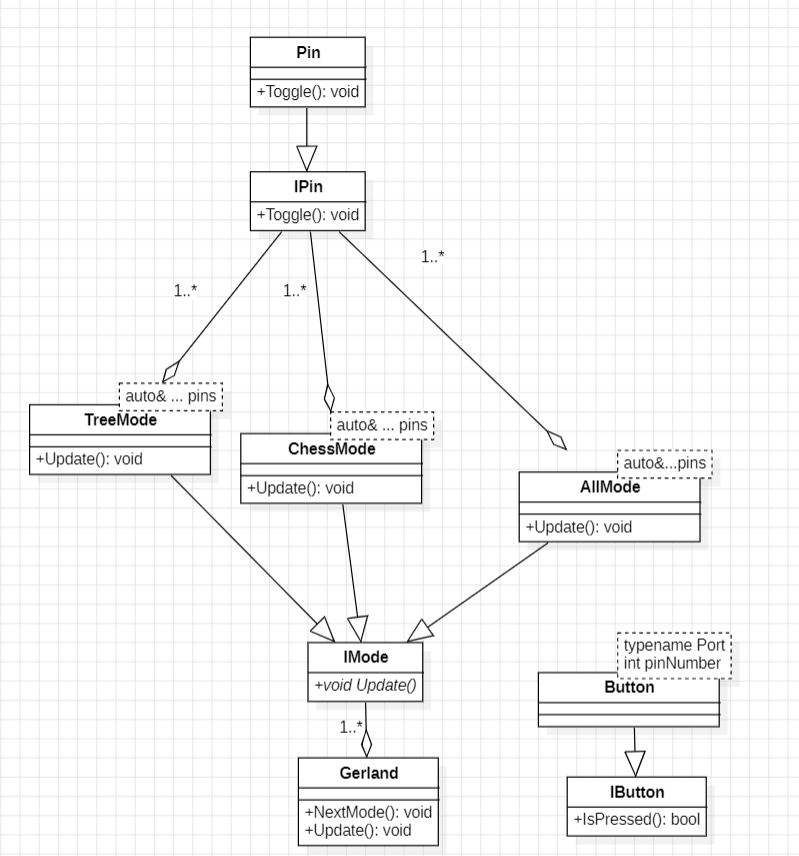

:figure-caption: Рисунок
:table-caption: Таблица

include::Tityl_list_3.adoc[lines=1..10]
[.text-right]

Лабораторная работа 6
include::Tityl_list_3.adoc[lines="12..25"]

<<Цель отчета>>

<<Архитиктура>>

<<Листинг программы и классов>>

<<Вывод по работе>>

== Цель отчета

. Создать архитектуру программы 

. Описать работу архитиктуры

. Привести листинг программы и классов 

== Архитиктура 

.Архитиктура

Видно что подкласс Pin наследует класс IPin, в котором находится виртуальная функция Toggle(). Это сделано для того чтобы можно было переписать функция Toggle() под требуемы задачи.

В данном случае подкласс Pin в функция Toggle() реализует переключение состояние светодиодов, для этого требуется:

* [*] Передать два параметра и написать строку, которая будет переключать состояние светодиодов -
[source, cpp]
---- 
template <typename Port, int pinNumber >
class Pin: public Ipin
{
public: 
  
  void Toggle() const override
  {
    Port::ODR::Toggle(1<<pinNumber);
  } 
};
----

Далее создается класс IMode, в котором находится виртуальная функция Update().

Подклассы которые наследуют IMode и переписывают функция Update() под требуемы задачи:

* [*] TreeMode
* [*] ChessMode
* [*] AllMode
* [*] Gerland
 
== Листинг программы и классов

== Вывод по работе

* [*] Изучены принципы SOLID.

* [*] Изучено что такое класс.

* [*] Изучено наследование классов.

* [*] На освное полученныех знаний создан класс ChessMode, отвечающий  за переключение светодиодов в шахматном порядке, с наследованием класса Mode.
   