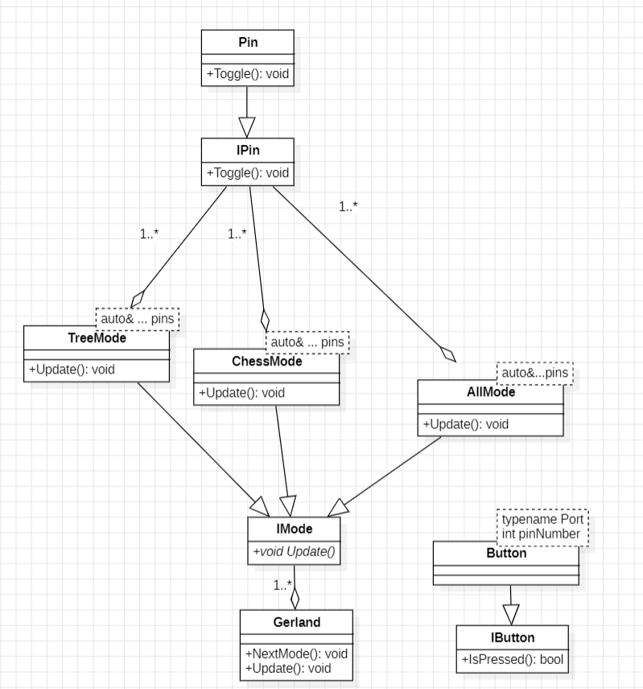

:figure-caption: Рисунок
:table-caption: Таблица

include::Tityl_list_3.adoc[lines=1..10]
[.text-right]

Лабораторная работа 6
include::Tityl_list_3.adoc[lines="12..25"]

<<Цель отчета>>

<<Архитектура>>

<<Листинг программы и классов>>

<<Вывод по работе>>

== Цель отчета

. Создать архитектуру программы 

. Описать работу архитектуры

. Привести листинг программы и классов 

== Архитектура 

.Архитектура

Видно что подкласс Pin наследует класс IPin, в котором находится виртуальная функция Toggle(). Это сделано для того чтобы можно было переписать функция Toggle() под требуемы задачи.

В данном случае подкласс Pin в функция Toggle() реализует переключение состояние светодиодов, для этого требуется:

* [*] Передать два параметра и написать строку, которая будет переключать состояние светодиодов -
[source, cpp]
---- 
template <typename Port, int pinNumber >
class Pin: public Ipin
{
public: 
  
  void Toggle() const override
  {
    Port::ODR::Toggle(1<<pinNumber);
  } 
};
----

Далее создается класс IMode, в котором находится виртуальная функция Update().

Подклассы которые наследуют IMode и переопределяют функцию Update() под требуемы задачи:

* [*] TreeMode - переключение светодиодов елочкой
* [*] ChessMode - переключение светодиодов шахматным порядком 
* [*] AllMode - переключение всех светодиодов
* [*] Gerland - класс в котором перебираются выше перечисленные режимы

Затем создается класс IButton, в котором находится виртуальная функция IsPressed().

Подклассы которые наследуют IButton и переопределяют функция IsPressed() под требуемы задачи - смена режима светодидо по нажатой кнопке 

== Листинг программы и классов

* Листинг main.cpp
[source, cpp]
----
#include "rccregisters.hpp"     // for RCC
#include "gpioaregisters.hpp"   // for GPIOA
#include "gpiocregisters.hpp"   // for GPIOC
#include "Pin3.h"               // for pin
#include "Treemode.h"           // for metod pins
#include "ChMode.h"             // for metod pins
#include "Gerland.h"            // for metod pins
#include "AllMode.h"            // for metod pins
#include "Button2.h"            // for button
#include "tim5registers.hpp"    // for TIM5

std::uint32_t SystemCoreClock = 16'000'000U;

void delay(int cycles)
{
  for(int i = 0; i < cycles; ++i)    
  {   
    asm volatile("");
  }    
}

void LowSetLed() 
{
  GPIOA::ODR::ODR5::Low::Set();
  GPIOC::ODR::ODR9::Low::Set();
  GPIOC::ODR::ODR8::Low::Set();
  GPIOC::ODR::ODR5::Low::Set();
}

Pin<GPIOA, 5>  pin1;
Pin<GPIOC, 9>  pin2;
Pin<GPIOC, 8>  pin3;
Pin<GPIOC, 5>  pin4;

uint8_t flag = 1;

Button btn;

AllMode<pin1, pin2, pin3, pin4> allMode;
TreeMode<pin1,pin2, pin3, pin4> treemode;
ChessMode<pin1,pin2, pin3, pin4> chessmode;

Gerland<treemode, chessmode, allMode> gerland;

int main()
{  
  // Подать тактирование на порт А
  RCC::AHB1ENR::GPIOAEN::Enable::Set() ;
  // Подать тактирование на порт А
  RCC::AHB1ENR::GPIOCEN::Enable::Set() ;
  // Порт  А.5 на вывод
  GPIOA::MODER::MODER5::Output::Set() ;
  // Порта С.5,С.8,С.9 на вывод
  GPIOC::MODER::MODER5::Output::Set() ;
  GPIOC::MODER::MODER8::Output::Set() ;
  GPIOC::MODER::MODER9::Output::Set() ;
  
  GPIOC::MODER::MODER13::Input::Set(); // вкдючили кнопку
 
  
  for(;;)
  { 
    if (btn.IsPressed() == true and flag == 1) 
    {
     LowSetLed();
     delay(1000000);
     gerland.NextMode();
     flag = 0;
    }
    else 
    {
     flag = 1;
    }
    gerland.Update();
    delay(1000000);
  }
  
  return 1;
}

----

* Листинг Button.h
[source, cpp]
----
#ifndef BUTTON
#define BUTTON
#include "IButton.h"
#include "Gerland.h"
#include <array>

class Button : public IButton
{
public:
  bool IsPressed() override   
  {
    if (GPIOC::IDR::IDR13::Low::IsSet()) 
    {
      return true;
    }
    else 
    {
     return false;
    }
  } 
};

#endif
----

* Листинг IButton.h
[source, cpp]
----
#ifndef IBUTTON
#define IBUTTON
class IButton
{
public:
  virtual bool IsPressed() = 0;
};

#endif
----

* Листинг Gerland.h
[source, cpp]
----
#ifndef GERLAND
#define GERLAND
#include "Mode.h"
#include "ipin.h"
#include <array>

template <auto& ... modes>
class Gerland: public Mode 
{
public:
  void NextMode() 
  {
    if (i == rezhim.size()) 
    {
     i = 0;
    }
    currentMode = rezhim[i];
    i++;
    
     
  }
  
  
  void Update()
  {
    currentMode->Update();
  }

private:
  std:: size_t i = 0;

  std:: array<Mode*, sizeof ... (modes) > rezhim = {&modes ... };
  
  Mode* currentMode = rezhim[0];

};
#endif
----

== Вывод по работе

* [*] Создана Архитектура

* [*] Приведен листинг программы и новых классов 

* [*] Перед началом программирования, следует создать архитектуру, в которой должны быть все базовые  и производны классы, так как это является основой в программировании и является хорошим тоном

* [*] Данную работу можно посчитать шаблоном для других проектов на отладочных платах, в которых место светодиодов можно использовать разные датчики, создавай базовые класс и производные классы которые далее можно будет переназначать на другие функции датчика и в зависимости от требуемых задач пользовать нужным производным классом, а не переписывать код полностью