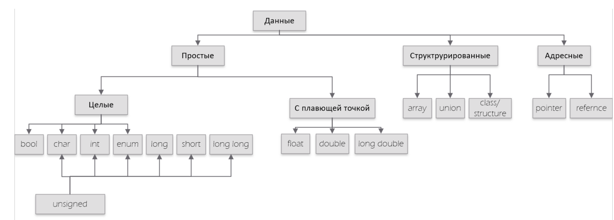
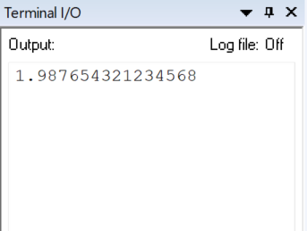

:figure-caption: Рисунок
:table-caption: Таблица
[.text-center]
Министерство науки и высшего образования Российской Федерации Федеральное государственное образовательное учреждение высшего образования
«Южно-Уральский государственный университет» (Национальный исследовательский университет)
[.text-center]
Высшая школа электроники и компьютерных наук Кафедра «Информационно-измерительная техника»

[.text-center]
дисциплина: 1.Ф.П1.06 (Программное обеспечение измерительных процессов)

[.text-center]
Отчет №3

[.text-right]
Работу принял, доцент +
___/ С.В. Колодий / +
___2023 г.

[.text-right]
Автор работы +
студент группы КЭ-413 +
___/ А.С. Нежурбида / +
___2023 г.

[.text-center]
Челябинск 2023

:toc:
toc::[]
== Оглавление

<<Цель отчета>>

<<Портируемость проекта>>

<<Типы данных>>

<<Память микроконтроллера>>

<<Вывод по работе>>

== Цель отчета

. Изучить портируемость проекта
. Изучить типы данных
.. Встроенные типы;
.. Модификаторы типов данных;
.. Размеры типов данных;
.. Пользовательские типы;
.. Псевдонимы типов;
.. Неявное преобразование типов;
.. Явное преобразование типов.

. Изучить память микроконтроллера CortexM4
.. Память для расположения данных;
.. Память под функции(команды).

== Портируемость проекта

Портируемость проекта - возможность переноса программного обеспечения с одного вида микроконтроллера на другой. Возможность перенос проекта на другие микроконтроллеры без каких либо серьезных проблем выполняется  за счет:

* [*] Использования одинаковых типов данных, в которых установлен  один размер. Это нужно для разных ядер
микроконтроллеров, чтобы  один и тот же тип переменной имел одинаковый размер.

* [*]  Разделять часть, которая отвечает за аппаратуру и аппаратные модули, зависящую от
микроконтроллера и бизнес логику, которая не зави   сит от аппаратуры
* [*]  Использовать разделение реализации и интерфейсо

== Типы данных
Структурная схема типов данных показана на рисунке 1.
Для выполнения практических заданий по программированию на языке С++ ранее использовались:

* [*] bool 
* [*] char
* [*] int 
* [*] float 
* [*] double

[#Типы данных]
.Типы данных

Типы данных делятся на встроенные и модифицировынные (модификаторы).
К встроенным относятся:

. bool - 1 байт;
. char - 1 байт;
. unsigned char - 1 байт; 
. int - 4 байта;
. unsigned int - 4 байта;  
. float - 4 байта;
. double - 8 байта.

К модифицированным относятся:

. short int - 2 байта;
. unsigned short int - 2 байта;
. long int - 8 байт;
. unsigned long int - 8 байт; 
. long double - 8 байт.

Для разных  микроконтроллеров определены разные размеры типов, не всегда, но такое возможно. Для того чтобы размеры типов не менялись существует правило записи. Правильно заключается в использовании псевдонимов:

std::uint32_t - "u" сокращение от  unsigned, данная запись является  целым беззнаковым, длиной 32 бита. 

std::int32_t целое знаковое длинной 32 бита

Помимо этого существуют пользовательские типы, они позволяют определить свой тип, либо сделать псевдоним типа, пример:

[source,ruby]
----
template<typename T>
struct Complex
{
  Complex(T r, T im): real{r}, imaginary{im} {} ;
  operator T { return sqrt(real*real + imaginary* imaginary) ;}
  Complex operator +(Complex value)
  {
  return Complex(real+ value.real, imaginary + value.imaginary) ;
  }
  private:
  T real; //вещественная часть
  T imaginary //мнимая часть
} ;
int main()
{
  Complex<float> value1(3.0f, 4.0f) ;
  Complex<float> value1(1.0f, 2.0f) ;
  value1 += value2 ;
  return 0;
}
----
Пример псевдонима типов:
[source,ruby]
----
auto t = std::make_tuple(10, "Test", 3.14, 2U); 
using tMytype = decltype(t) ; 
using tShortType = std::tuple<int, string, double, tU32> ; 
void myfunction(tMyType & value) { 
  ...
}
int main() {
  using tU32 = unsigned int ; 
  tU32 i = 10U ; 
  myfunction(t) ; 
}
----
Главными ошибками при работе с типами данных является неявное преобразование типов, также известен, как автоматическое преобразование типов. Из за этого могут происходить ошибки в коде. Приведу пример неявных преобразований:
[source,ruby]
----
int a = 0; 
char a = 512; 
int a = 3.14; 
bool a = -4;
bool a = 0;
----
Пример кода с неявным  преобразованием типов данных:
[source,ruby]
----
#include <iostream>

int main()
{
  auto i = 1.98765432123456789;
  
  printf ("%4.15f", i);
  return 0;
}
----
На рисунке 2 показан результат работы программы.

[#Неявное преобразование типа данных]
.Результат работы программы

Видно что происходит неявное преобразование типов данных и переменной i присвоен тип double. Следовательно не нужно использовать неявное преобразование типа.

Лучше воспользоваться явным преобразование типа данных, так как это спасёт вас от нелепых ошибок. Для этого сущесвтует static_cast.

static_cast - позволяет сделать приведение близких типов (целые, пользовательских типов
которые могут создаваться из типов который приводится, и указатель на void* к указателю
на любой тип). Проверка производится на уровне компиляции, так что в случае ошибки сообщение будет
получено в момент сборки приложения или библиотеки. Примеры:

[source,ruby]
----
int a = static_cast<int>(0);
int a = static_cast<int>(3.14);
bool a = static_cast<bool>(-4);
bool a = static_cast<bool>(0);
float f = 3.14f ;
float f = static_cast<float>(3.14) ;
Complex f = static_cast<3.14>;
----

== Память микроконтроллера

Различные типы памяти могут быть расположены по адресам от 0x00000000 до 0xFFFFFFFF. Обычно
микроконтроллер имеет постоянную память, из которой можно только читать (ПЗУ) и
оперативную память, из которой можно читать и в которую можно писать (ОЗУ)

Микроконтроллер на ядре Cortex M4 выполнен по Гарвардской архитектуре, память здесь
разделена на три типа:

* [*] FLASH - память в которой храниться программа, находится по адресам 0x00000000 по 0x1FFFFFFF.

* [*] RAM -  память для хранения временных данных, находится по адресам 0x20000000 по 0x3FFFFFFF, память в которой находятся регистры отвечающие за настройку и работу с периферией, находится по адресам с 0x40000000 по 0x5FFFFFFF. 

* [*] ЕЕPROM - память для хранения постоянных данных, микропроцессора Stm32F411RE EEPROM  не содержит.

Данные в памяти могут быть расположены 3 различными способами:

. В виде локальных переменных, которые являются локальными в функции располагаются
в регистрах или в стеке. Такие переменные "существуют" только внутри функции, как только функция закончится и вернется к вызывающему объекту, эти переменные становятся не валидными.

. Глобальные переменные или статические переменные. В этом случае они
инициализируются единожды. Static означает, что та память, которая была выделена под эту переменную не будет изменяться и закрепляется за этой переменной до конца работы приложения.

. Динамически размещаемые данные. Данные создаваемые на Heap. Если заранее не известно, сколько объектов нужно создать, и сколько памяти они будут отнимать, то придется создавать их динамически, например с помощью оператора new, в таком случае, объекты будут создаваться в куче.

== Вывод по работе

* [*] Для портируемости проекта требуется соблюдать явного преобразования типов.

* [*] Повторены основные типы данных.

* [*] Ознакомился с подкатегориями типов данных.

* [*] Изучил возможность создания пользовательских  типов данных.

* [*] Изучил виды памяти и данных которые в них сохраняются.
